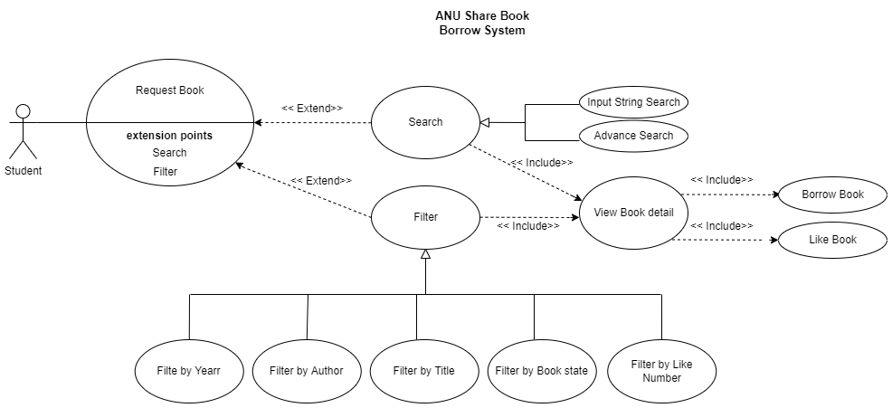
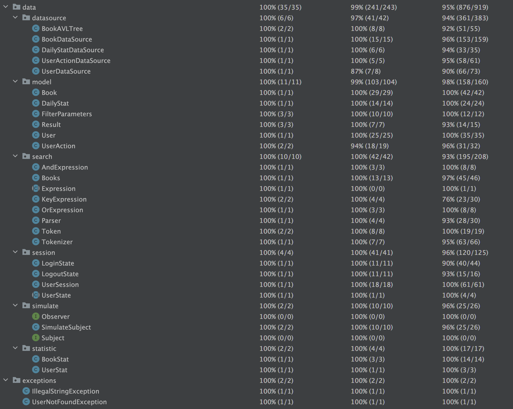
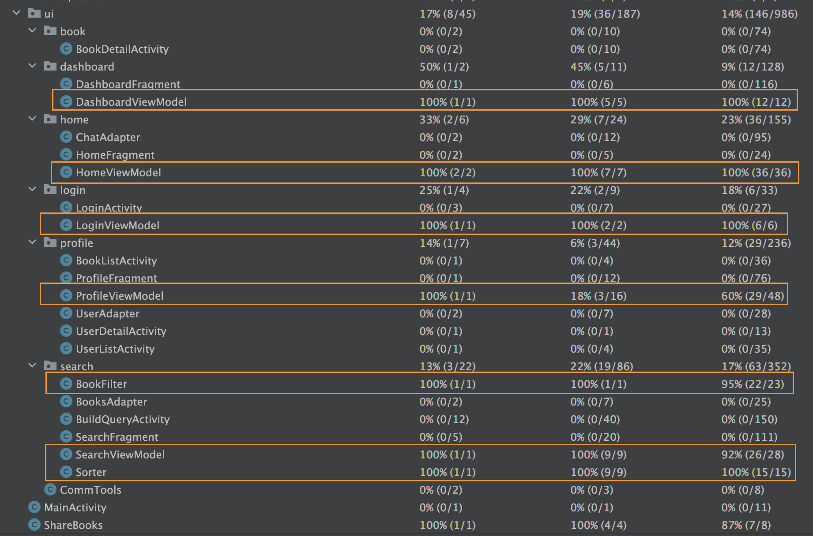

# 📚 ShareBooks App

A feature-rich Android application developed as part of a university group project. ShareBooks enables university students to share, search, and interact with secondhand books in a dynamic and user-centric platform. The app emphasizes data structuring, search grammar parsing, interactive features, and privacy-conscious design.

---

## 🛠️ Local Setup & Run Instructions

To run this project locally, please follow the steps below:

### ✅ Recommended Environment

- **OS**: macOS / Windows / Linux
- **IDE**: [Android Studio (Arctic Fox or newer)](https://developer.android.com/studio)
- **JDK**: Java 17+
- **Gradle**: Provided via Gradle Wrapper (`./gradlew`)
- **Android SDK**: Your `local.properties` should point to the correct SDK path

### ▶️ Steps to Run the App

1. **Clone the repository**:
   ```bash
   git clone https://github.com/Anbo-WU/BookSharing.git
   ```
2. **Open the project in Android Studio**

   - Open Android Studio and Open the project through your localpath/BookSharing/src. Be careful you need to locate your entry point at src, not the root file BookSharing. Otherwise, Android Studio cannot directly run the App. 
   - Wait for **Gradle sync** to complete automatically

3. **Build the project**

   - In the top menu: `Build → Make Project`. It may take a few minutes cause there are lots of dependencies to be installed in the first time!

4. **Run the application**

   - Select an emulator or connected Android device  
   - Click the green **Run** button or press `Shift + F10`
## 🚀 Features

### ✅ Core Features
- **User Authentication**: Secure login/logout functionality for users.
- **Structured Dataset**: Custom dataset with over 4,000 book records stored in structured formats (XML, JSON).
- **Data Loading & Visualization**: Book data and user interaction streams are dynamically loaded and displayed.
- **Custom Search Grammar**: Users can search using a formally defined grammar and parser designed from scratch.
- **Search Engine**: Tokenizer and parser handle real-time query parsing, validation, and error handling.

### ☑️ Custom Enhancement Features
#### 🛡 Privacy-Focused Search
- Validity-based search result rendering
- Advanced search result filtering and sorting

#### 📊 Enhanced Data Handling
- **Multiple File Format Support**: Reads data from both XML ([BookDataSource.java](/src/app/src/main/java/anu/g35/sharebooks/data/datasource/BookDataSource.java)) and JSON ([UserDataSource.java](/src/app/src/main/java/anu/g35/sharebooks/data/datasource/UserDataSource.java))
- **User Profile Page**: Includes media files and personal data visualization
- **Graphical Reports**: View summarized app data through graphical components

#### 🤝 User Interactivity
- **Micro-interactions**: Like, dislike, borrow, and return books
- **Follow System**: Users can follow items, with grouped view of all followed entries

---
### 🧱 Architecture Overview

The following UML class diagram provides an overview of the system's core structure and data flow:



---
### 🧩 Design Patterns

This project adopts multiple classic software design patterns to improve modularity, scalability, and maintainability. Below are the patterns used and their rationale.


#### 1. **Singleton Design Pattern**
- **Objective**: Provide consistent access handles to various data sources.
- **Code Location**: [`BookDataSource`](/src/app/src/main/java/anu/g35/sharebooks/data/datasource/BookDataSource.java)
- **Rationale**:
  - Ensures only one instance of the data access object exists throughout the application.
  - Provides a centralized access point, simplifying data management and improving consistency.
  - Maintains a global shared state for the access handle, which promotes data integrity.


#### 2. **State Design Pattern**
- **Objective**: Manage the two core user session states — logged in and logged out.
- **Code Location**: [`session` package](/src/app/src/main/java/anu/g35/sharebooks/data/session)
- **Rationale**:
  - Clearly defines transition logic between user states, enhancing code clarity.
  - Encapsulates each state in its own class, allowing for easier extension and maintenance.
  - Avoids deeply nested conditional logic (`if-else` chains), resulting in lower code complexity and coupling.


#### 3. **Observer Design Pattern**
- **Objective**: Simulate user session-related actions for UI chat activity by broadcasting user behavior/events.
- **Code Locations**:  
  - [`simulate` package](/src/app/src/main/java/anu/g35/sharebooks/data/simulate)  
  - [`UserSession`](/src/app/src/main/java/anu/g35/sharebooks/data/session/UserSession.java)  
  - [`HomeViewModel`](/src/app/src/main/java/anu/g35/sharebooks/ui/home/HomeViewModel.java)
- **Rationale**:
  - Promotes **loose coupling** between components; observers don't need to know about the internal state of the subject.
  - Allows **scalable communication** — multiple observers can subscribe to a subject without modifying its implementation.
  - Improves **modularity and testability** by reducing direct dependencies through abstract interfaces or base classes.


### Grammar Definition
---
```text
<exp>  ::=  <term>
        |   <term> & <exp>
        |   <term> | <exp>
<term> ::= <key>
        |  ( <exp> )
<key>  ::= ISBN | TITLE | AUTHORS | CATEGORY | YEAR
```

* example:
  TITLE:man&AUTHORS:jan&(YEAR:2000|YEAR:1999)
* advantages
    * Clarity: The grammar structure is clear and easy to understand.
    * Flexibility: The grammar offers multiple combinations, allowing users to search for book information in different ways.
    * Extensibility: The grammar defines basic search terms and logical operators, making it easy to extend as needed.
    * Ease of Implementation: The grammar rules are simple and straightforward, making it easy to convert them into corresponding parser.


## 🧪 Testing Summary
### Backend Unit Tests
- Codebase: [`/data` test package](/src/app/src/test/java/anu/g35/sharebooks/data)
- Number of test cases: **98**
- Coverage: **95%**
- Screenshot:  
  

### UI Logic Tests
- Codebase: [`/ui` test package](/src/app/src/test/java/anu/g35/sharebooks/ui)
- Number of test cases: **21**
- Coverage: **95%**
- Screenshot:  
  


---

### 📄 License

This project is licensed under the [Creative Commons Attribution-NonCommercial 4.0 International (CC BY-NC 4.0)](https://creativecommons.org/licenses/by-nc/4.0/).

You are free to view, download, and adapt this project for **non-commercial academic or educational purposes** with proper attribution. **Commercial use is strictly prohibited.**
