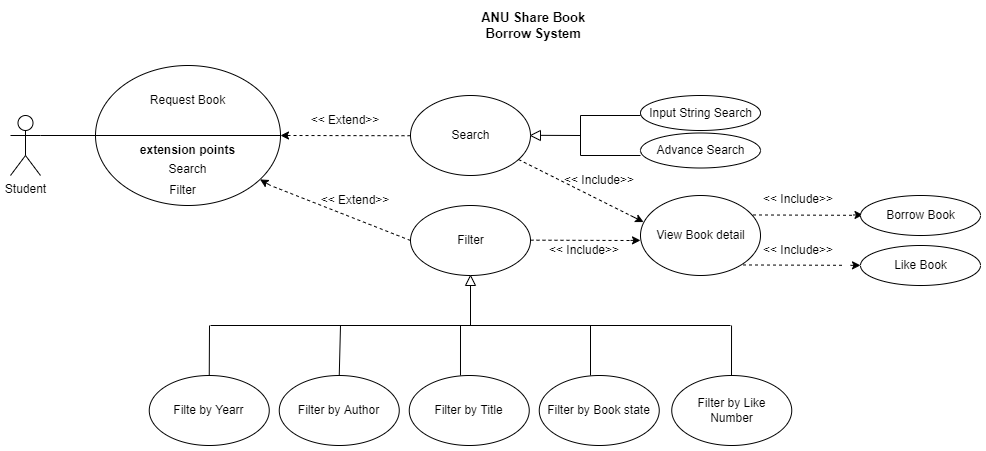
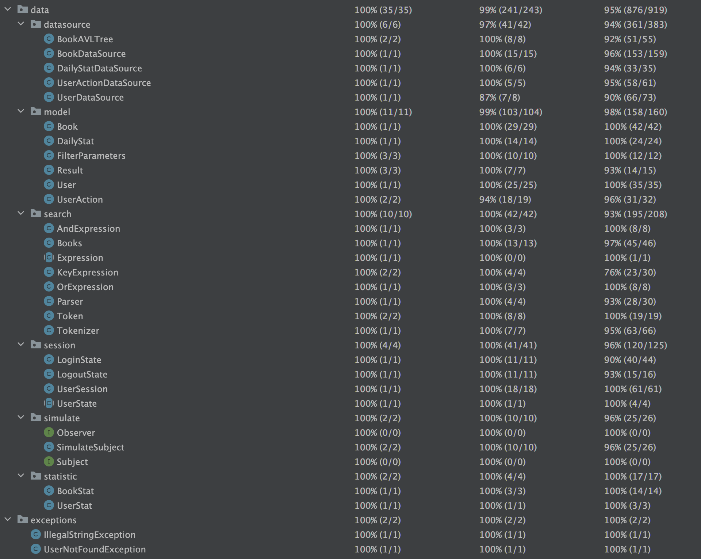
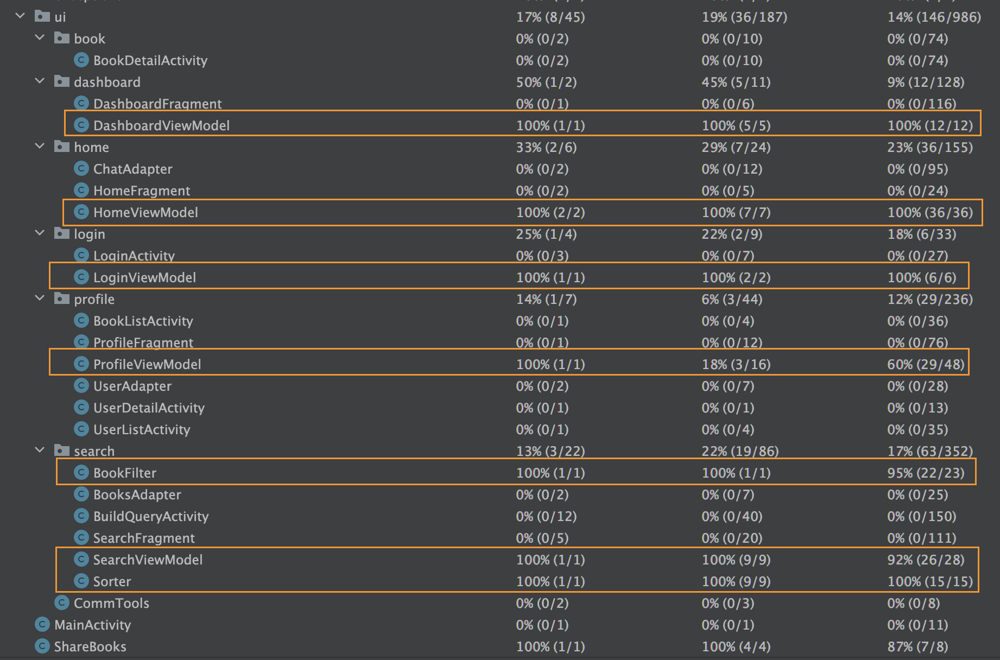

# [G35] Project Report

## Table of Contents

1. [Team Members and Roles](#team-members-and-roles)
2. [Summary of Individual Contributions](#summary-of-individual-contributions)
3. [Application Description](#application-description)
4. [Application UML](#application-uml)
5. [Application Design and Decisions](#application-design-and-decisions)
6. [Summary of Known Errors and Bugs](#summary-of-known-errors-and-bugs)
7. [Testing Summary](#testing-summary)
8. [Implemented Features](#implemented-features)
9. ['Surprise' Assignment](#surprise-features)
10. [Team Meetings](#team-meetings)
11. [Conflict Resolution Protocol](#conflict-resolution-protocol)
12. [Appendixes](#appendixes)

## Administrative
- Two user accounts for markers' access are usable on the app's APK (do not change the username and password unless there are exceptional circumstances. Note that they are not real e-mail addresses in use):
   - Username: comp2100@anu.edu.au	Password: comp2100
   - Username: comp6442@anu.edu.au	Password: comp6442

## Team Members and Roles
The key area(s) of responsibilities for each member

| UID        |     Name      |                                                                                                                                           Role |
|:-----------|:-------------:|-----------------------------------------------------------------------------------------------------------------------------------------------:|
| [u7706346] |   [Anbo Wu]   |  [responsible for meeting minutes, report, `Data-Graphical` custom feature, `[Interact-Micro]` custom feature `[LoadShowData]` basic feature.] |
| [u7723366] | [Huizhe Ruan] |                                            [responsible for meeting minutes, 'Search-Invalid' custom feature, 'Search-Filter' custom feature.] |
| [u7703247] |  [Chuang Ma]  |                     [responsible for general code structure, `Login` basic feature, `DataStream` basic feature, `Data-Formats` custom feature.] |
| [u7615533] | [Junfeng Gao] |                                                             [responsible for 'Search-Invalid' custom feature, 'Search-Filter' custom feature.] |
| [u7722376] |   [Diao Fu]   |                 [responsible for general code structure, 'LoadShowData' basic feature, 'Search' basic feature, 'Data-Formats' custom feature.] |

## Summary of Individual Contributions

### 1. **u7706346, Anbo Wu**  I have 19% contribution, as follows:  
  - **Code Contribution in the final App**
    - `[LoadShowData]` basic feature, Load the image using Glide: [CommTools.java](https://gitlab.cecs.anu.edu.au/u7706346/gp-24s1/-/blob/main/src/app/src/main/java/anu/g35/sharebooks/ui/CommTools.java?ref_type=heads); loading daily statistics data from a JSON file: [DailyStatDataSource.java](https://gitlab.cecs.anu.edu.au/u7706346/gp-24s1/-/tree/main/src/app/src/main/java/anu/g35/sharebooks/data/datasource/DailyStatDataSource.java)
    - `[Data-Graphical]` custom feature, loading the statistics information of books and users: [File BookStat (all classes in this file are authored by me)](https://gitlab.cecs.anu.edu.au/u7706346/gp-24s1/-/tree/main/src/app/src/main/java/anu/g35/sharebooks/data/statistic?ref_type=heads); [DailyStat.java](https://gitlab.cecs.anu.edu.au/u7706346/gp-24s1/-/tree/main/src/app/src/main/java/anu/g35/sharebooks/data/model/DailyStat.java) [DashboardFragment.java](https://gitlab.cecs.anu.edu.au/u7706346/gp-24s1/-/blob/main/src/app/src/main/java/anu/g35/sharebooks/ui/dashboard/DashboardFragment.java); [DashboardViewModel.java](https://gitlab.cecs.anu.edu.au/u7706346/gp-24s1/-/blob/main/src/app/src/main/java/anu/g35/sharebooks/ui/dashboard/DashboardViewModel.java)
    - `[Interact-Micro]` custom feature, displays the details of a book like title, authors, category, etc. It also allows the user to like/dislike the book, borrow/return the book, and view the book owner's profile: [BookDetailActivity.java](https://gitlab.cecs.anu.edu.au/u7706346/gp-24s1/-/blob/main/src/app/src/main/java/anu/g35/sharebooks/ui/book/BookDetailActivity.java?ref_type=heads); [activity_book_detail.xml](https://gitlab.cecs.anu.edu.au/u7706346/gp-24s1/-/blob/main/src/app/src/main/res/layout/activity_book_detail.xml)
    - Singleton Design Pattern --  class DailyStatDataSource: [DailyStatDataSource.java](https://gitlab.cecs.anu.edu.au/u7706346/gp-24s1/-/tree/main/src/app/src/main/java/anu/g35/sharebooks/data/datasource/DailyStatDataSource.java#L26)
    - UI files contribution -- [BookDetailActivity.java](https://gitlab.cecs.anu.edu.au/u7706346/gp-24s1/-/blob/main/src/app/src/main/java/anu/g35/sharebooks/ui/book/BookDetailActivity.java?ref_type=heads), [DashboardFragment.java](https://gitlab.cecs.anu.edu.au/u7706346/gp-24s1/-/blob/main/src/app/src/main/java/anu/g35/sharebooks/ui/dashboard/DashboardFragment.java), [DashboardViewModel.java](https://gitlab.cecs.anu.edu.au/u7706346/gp-24s1/-/blob/main/src/app/src/main/java/anu/g35/sharebooks/ui/dashboard/DashboardViewModel.java)
  
  - **Code and App Design** 
    - [design patterns] : Singleton Design Pattern -- [DailyStatDataSource.java](https://gitlab.cecs.anu.edu.au/u7706346/gp-24s1/-/tree/main/src/app/src/main/java/anu/g35/sharebooks/data/datasource/DailyStatDataSource.java#L26)
    - [UI Design] : I designed the statistic information UI, see that in the introduction of `[Data-Graphical]` custom feature above. The Ui images are shown below.
    ; 
        
  - **Others**: 
    - [Report Writing] : Responsible for the most part of the report: Part1 - Part4; Part6 - Part12
    - [Meeting Minutes] : Completed the 2ed, 3rd, 4th, 5th meeting minutes.
    - [Video] : Reviewed and rectified the narration manuscript for the video.

### 2. **u7723366, Huizhe Ruan**  I have 19% contribution, as follows:  
  - - **Code Contribution in the final App**
    
      - `[LoadShowData]` basic feature -- class ChatAdapter: [ChatAdapter.java](src/app/src/main/java/anu/g35/sharebooks/ui/home/ChatAdapter.java); HomeFragment: [HomeFragment.java](src/app/src/main/java/anu/g35/sharebooks/ui/home/HomeFragment.java); HomeViewModel: [HomeViewModel.java](src/app/src/main/java/anu/g35/sharebooks/ui/home/HomeViewModel.java)
        - ChatAdapter.java: Adapter for displaying chat messages in the home fragment.
        - HomeFragment.java: Fragment for displaying the home screen, including chat messages.
        - HomeViewModel.java: ViewModel for managing data and logic for the home fragment.
    
      - `[Data-Graphical]` basic feature -- class BookFilter: [BookFilter.java](src/app/src/main/java/anu/g35/sharebooks/ui/search/BookFilter.java); SearchFragment: [SearchFragment.java](src/app/src/main/java/anu/g35/sharebooks/ui/search/SearchFragment.java); FilterParameters: [FilterParameters.java](src/app/src/main/java/anu/g35/sharebooks/data/model/FilterParameters.java); BooksAdapter: [BooksAdapter.java](src/app/src/main/java/anu/g35/sharebooks/ui/search/BooksAdapter.java); BuildQueryActivity: [BuildQueryActivity.java](src/app/src/main/java/anu/g35/sharebooks/ui/search/BuildQueryActivity.java); SearchViewModel: [SearchViewModel.java](src/app/src/main/java/anu/g35/sharebooks/ui/search/SearchViewModel.java)
        - BookFilter.java: Class for filtering books based on various criteria.
        - SearchFragment.java: Fragment for displaying the search screen and search results.
        - FilterParameters.java: Model class for storing filter parameters.
        - BooksAdapter.java: Adapter for displaying books in the search results.
        - BuildQueryActivity.java: Activity for building search queries.
        - SearchViewModel.java: ViewModel for managing data and logic for the search functionality.
    
      - UI files contribution -- [chat_item.xml](src/app/src/main/res/layout/chat_item.xml), [fragment_home.xml](src/app/src/main/res/layout/fragment_home.xml), [fragment_search.xml](src/app/src/main/res/layout/fragment_search.xml), [activity_build_query.xml](src/app/src/main/res/layout/activity_build_query.xml), [dialog_filter.xml](src/app/src/main/res/layout/dialog_filter.xml)
        - chat_item.xml: Layout for individual chat items in the home fragment.
        - fragment_home.xml: Layout for the home fragment.
        - fragment_search.xml: Layout for the search fragment.
        - activity_build_query.xml: Layout for the build query activity.
        - dialog_filter.xml: Layout for the filter dialog.
    
      - Unit tests contribution -- [FilterParametersTest.java](src/app/src/test/java/anu/g35/sharebooks/data/model/FilterParametersTest.java), [SorterTest.java](src/app/src/test/java/anu/g35/sharebooks/data/search/SorterTest.java), [HomeViewModelTest.java](src/app/src/test/java/anu/g35/sharebooks/ui/home/HomeViewModelTest.java), [SearchViewModelTest.java](src/app/src/test/java/anu/g35/sharebooks/ui/search/SearchViewModelTest.java), [DashboardViewModelTest.java](src/app/src/test/java/anu/g35/sharebooks/ui/dashboard/DashboardViewModelTest.java)
        - FilterParametersTest.java: Unit tests for the FilterParameters class.
        - SorterTest.java: Unit tests for the Sorter class.
        - HomeViewModelTest.java: Unit tests for the HomeViewModel class.
        - SearchViewModelTest.java: Unit tests for the SearchViewModel class.
        - DashboardViewModelTest.java: Unit tests for the DashboardViewModel class.
    
        
    
  - **Code and App Design**
    - [Design Patterns]: Singleton Design Pattern
    
      - Used the Singleton pattern for classes like BookDataSource and FilterParameters to ensure a single instance throughout the app.

    - [Data Structures]: ArrayList, HashMap
    
      - Utilized ArrayList for storing and displaying lists of books, chats, and search results.
      - Employed HashMap for efficient lookup and mapping of data, such as book details and filter parameters.
    
    - [UI Design]: Designed and implemented the user interface for the home screen, search screen, and book details screen.
    
      - Proposed a clean and intuitive layout for the home screen, featuring a list of chat messages and a navigation bar.
      - Designed the search screen with a search bar, filter options, and a scrollable list of search results.
      - Created a detailed book information screen with options to like, dislike, borrow, and return books.
      - Used Android Studio's layout editor and XML for designing and implementing the UI components.
    
        
    
  - **Others**:
    - [Report Writing]: Contributed to the project report from version 1 - 6
      - Actively participated in writing and editing the project report.
      - Provided insights and descriptions for the implemented features, design decisions, and testing approaches.
      - Collaborated with team members to ensure the report's clarity, coherence, and adherence to the required format.
    - [Meeting Minutes]: Completed the 1st and 3nd meeting minutes.
      - Recorded and documented the discussions, decisions, and action items from the 2nd and 3rd project meetings.
      - Ensured that the meeting minutes were accurate, comprehensive, and distributed to all team members.
    -  

### 3. **u7703247, Chuang Ma**  I have 24% contribution, as follows:  
- **Code Contribution in the final App**
    - `[Login]` basic feature, make users able to log in and log out: [Session Package](https://gitlab.cecs.anu.edu.au/u7706346/gp-24s1/-/tree/main/src/app/src/main/java/anu/g35/sharebooks/data/session?ref_type=heads); [LoginActivity.java](https://gitlab.cecs.anu.edu.au/u7706346/gp-24s1/-/blob/main/src/app/src/main/java/anu/g35/sharebooks/ui/login/LoginActivity.java?ref_type=heads), [LoginViewModel.java](https://gitlab.cecs.anu.edu.au/u7706346/gp-24s1/-/blob/main/src/app/src/main/java/anu/g35/sharebooks/ui/login/LoginViewModel.java?ref_type=heads)
    - `[DataStream]` basic feature, created data instances to simulate users’ actions and interactions.: [Simulate Package](https://gitlab.cecs.anu.edu.au/u7706346/gp-24s1/-/tree/main/src/app/src/main/java/anu/g35/sharebooks/data/simulate?ref_type=heads); 
    - `[Data-Formats]` custom feature, loading user action data from an XML file: [UserActionDataSource.java](https://gitlab.cecs.anu.edu.au/u7706346/gp-24s1/-/blob/main/src/app/src/main/java/anu/g35/sharebooks/data/datasource/UserActionDataSource.java?ref_type=heads); loading user data from a JSON file to authenticating the user:[UserDataSource.java](https://gitlab.cecs.anu.edu.au/u7706346/gp-24s1/-/blob/main/src/app/src/main/java/anu/g35/sharebooks/data/datasource/UserDataSource.java?ref_type=heads)
    - `Singleton Design Pattern` --  class UserDataSource: [UserDataSource.java](https://gitlab.cecs.anu.edu.au/u7706346/gp-24s1/-/blob/main/src/app/src/main/java/anu/g35/sharebooks/data/datasource/UserDataSource.java?ref_type=heads#L28)
    - `Observer Design Pattern` -- class SimulateSubject:[SimulateSubject.java](https://gitlab.cecs.anu.edu.au/u7706346/gp-24s1/-/blob/main/src/app/src/main/java/anu/g35/sharebooks/data/simulate/SimulateSubject.java?ref_type=heads#L13)
    - UI files contribution -- [LoginActivity.java](https://gitlab.cecs.anu.edu.au/u7706346/gp-24s1/-/blob/main/src/app/src/main/java/anu/g35/sharebooks/ui/login/LoginActivity.java?ref_type=heads), [LoginViewModel.java](https://gitlab.cecs.anu.edu.au/u7706346/gp-24s1/-/blob/main/src/app/src/main/java/anu/g35/sharebooks/ui/login/LoginViewModel.java?ref_type=heads)
        
- **Code and App Design**
    - [design patterns] : `Singleton Design Pattern` --   [UserDataSource.java](https://gitlab.cecs.anu.edu.au/u7706346/gp-24s1/-/blob/main/src/app/src/main/java/anu/g35/sharebooks/data/datasource/UserDataSource.java?ref_type=heads#L28); `Observer Design Pattern` -- [SimulateSubject.java](https://gitlab.cecs.anu.edu.au/u7706346/gp-24s1/-/blob/main/src/app/src/main/java/anu/g35/sharebooks/data/simulate/SimulateSubject.java?ref_type=heads#L13)
    - [UI Design] : I designed the Login UI, see that in the introduction of `[Login]` custom feature above. The Ui images are shown below.

    
- **Others**:
    - [Report Writing] : Responsible for some part of the report: Part4 - Part5; Part7 - Part9
    - [APK] : Completed the APK of this app.
    - [Basic Code for project] : Defines the user information: [User.java](https://gitlab.cecs.anu.edu.au/u7706346/gp-24s1/-/tree/main/src/app/src/main/java/anu/g35/sharebooks/data/model/User.java?ref_type=heads); Defines the user action data structure: [UserAction.java](https://gitlab.cecs.anu.edu.au/u7706346/gp-24s1/-/blob/main/src/app/src/main/java/anu/g35/sharebooks/data/model/UserAction.java?ref_type=heads)

### 4. **u7615533, Junfeng Gao**  I have 19% contribution, as follows:  
- **Code Contribution in the final App**
    - [LoadShowData] basic feature -- class BookDataSource: [BookDataSource.java](https://gitlab.cecs.anu.edu.au/comp2100/group-project/ga-23s2/-/blob/main/items/media/_examples/Dummy.java)
    - [Data-Graphical] basic feature -- class BookStat: [BookStat.java](https://gitlab.cecs.anu.edu.au/comp2100/group-project/ga-23s2/-/blob/main/items/media/_examples/Dummy.java) ; UserStat: [UserStat.java](https://gitlab.cecs.anu.edu.au/comp2100/group-project/ga-23s2/-/blob/main/items/media/_examples/Dummy.java)
    - Singleton Design Pattern --  class BookDataSource: [getInstance()](https://gitlab.cecs.anu.edu.au/comp2100/group-project/ga-23s2/-/blob/main/items/media/_examples/Dummy.java#L22-43), [function2()](the-URL)
    - UI files contribution -- [BookDetailActivity.java](../src/path/to/class/Student.java), [DashboardFragment.java](../src/path/to/class/Student.java), [DashboardViewModel.java](../src/path/to/class/Student.java).*, [LanguageTranslator class](../src/path/to/class/LanguageTranslator.java): function1(), function2(), ...   

- **Code and App Design**
    - [design patterns] : Singleton Design Pattern
    - [data structures] : AVL tree, Map
    - [UI Design] : Specify what design did the involved member propose? What tools were used for the design?]*   

- **Others**:
    - [Report Writing] : Responsible for the report V1.0 - V1.2
    - [Meeting Minutes] : Completed the 2ed and 3rd meeting minutes.
    - [You are welcome to provide anything that you consider as a contribution to the project or team.] e.g., APK, setups, firebase*   

### 5. **u7722376, Diao Fu**  I have 19% contribution, as follows:  
**Code Contribution in the final App**
- [LoadShowData] basic feature -- class BookDataSource:  [BookDataSource.java](https://gitlab.cecs.anu.edu.au/u7706346/gp-24s1/-/blob/main/src/app/src/main/java/anu/g35/sharebooks/data/datasource/BookDataSource.java);
- [data structures] : AVLtree,HashMap, HashSet[BookAVLTree.java](https://gitlab.cecs.anu.edu.au/u7706346/gp-24s1/-/blob/main/src/app/src/main/java/anu/g35/sharebooks/data/datasource/BookAVLTree.java)//[BookDataSource.java](https://gitlab.cecs.anu.edu.au/u7706346/gp-24s1/-/blob/main/src/app/src/main/java/anu/g35/sharebooks/data/datasource/BookDataSource.java)
- [LoadShowData]: Copy data from datasource for security.
- [Search]: Search for information on your app. must make use of a tokeniser and parser with a formal grammar of your own creation. [BookDataSource.java](https://gitlab.cecs.anu.edu.au/u7706346/gp-24s1/-/blob/main/src/app/src/main/java/anu/g35/sharebooks/data/datasource/BookDataSource.java);
- [Retrieve data from a local file]: Copy data from datasource for security.[BookDataSource.java]https://gitlab.cecs.anu.edu.au/u7706346/gp-24s1/-/blob/main/src/app/src/main/java/anu/g35/sharebooks/data/datasource/BookDataSource.java
- [Search-Invalid]:Search-Invalid,give meaningful results.
- [Tokenizer and parser]: [search package](https://gitlab.cecs.anu.edu.au/u7706346/gp-24s1/-/blob/main/src/app/src/main/java/anu/g35/sharebooks/data/search)
- [Copy data security][BookDataSource.java](https://gitlab.cecs.anu.edu.au/u7706346/gp-24s1/-/blob/main/src/app/src/main/java/anu/g35/sharebooks/data/datasource/BookDataSource.java)
- Others are shown in commit recording,thanks:).
- **Code and App Design**
-[design patterns] : Singleton Design Pattern[Class data/datasource/BookDataSource](https://gitlab.cecs.anu.edu.au/u7706346/gp-24s1/-/blob/main/src/app/src/main/java/anu/g35/sharebooks/data/datasource/BookDataSource.java)
-[Data Format] :XML: [BookDataSource.java](https://gitlab.cecs.anu.edu.au/u7706346/gp-24s1/-/blob/main/src/app/src/main/java/anu/g35/sharebooks/data/datasource/BookDataSource.java) 
- Others are shown in commit recording,thanks:).
  
- **Others**:
    - [Report Writing] : Responsible for the  part of the report: parser grammar, surprise code and all the Custom Features Basic Features and the features which are must obey in assignment document.
    - [Meeting Minutes] : Assistance in the 2ed, 3rd, 4th, 5th meeting minutes.
    - [Video] : shoot video and finish the scripts.
- **Code Contribution in the final App**
    - [LoadShowData] basic feature -- class BookDataSource: [BookDataSource.java](https://gitlab.cecs.anu.edu.au/u7706346/gp-24s1/-/blob/main/src/app/src/main/java/anu/g35/sharebooks/data/datasource/BookDataSource.java?ref_type=heads)
    - Singleton Design Pattern --  class BookDataSource:[Class data/datasource/BookDataSource](https://gitlab.cecs.anu.edu.au/u7706346/gp-24s1/-/blob/main/src/app/src/main/java/anu/g35/sharebooks/data/datasource/BookDataSource.java), 

## Application Description

*We designed an app called BookShares, aimed at expanding and enriching the cultural literacy and spiritual world of people in underdeveloped areas. Specifically, users can log in to the app to share books that are idle around them, while also viewing books shared by other users. Each user has their own personal homepage where they can follow or unfollow, like or unlike other users. They can also communicate with other users and complete the free donation or borrowing of idle books in real life. This App allows for the rational use of book resources available around users, optimizing resource allocation and meeting economic and sustainability requirements.*

### Application Use Cases and or Examples

 

### Application UML

 
 
 
 
 Detailed UML Diagram 

 
Conceptual UML Diagram

## Application Design and Decisions

### Data Structures

We used the following data structures in our project:

1. AVL Tree
    * Objective: used for storing book data for search feature.
    * Code Locations: defined in [Class data/datasource/BookAVLTree](https://gitlab.cecs.anu.edu.au/u7706346/gp-24s1/-/blob/main/src/app/src/main/java/anu/g35/sharebooks/data/datasource/BookAVLTree.java); processed using [Class data/datasource/BookDataSource](https://gitlab.cecs.anu.edu.au/u7706346/gp-24s1/-/blob/main/src/app/src/main/java/anu/g35/sharebooks/data/datasource/BookDataSource.java)
    * Reasons:
        * The search efficiency of AVL Tree is relatively high, with a time complexity of O(log n).
        * We need to quickly retrieve detailed data of books by their ISBN.
        * We need to store information about books using AVL Tree, where the ISBN key is used as the key for the tree's nodes.

2. HashSet and HashSet
    * Objective: We use HashSet and HashMap together to store various categorial information of books.
    * Code Locations: [Class data/datasource/BookDataSource](https://gitlab.cecs.anu.edu.au/u7706346/gp-24s1/-/blob/main/src/app/src/main/java/anu/g35/sharebooks/data/datasource/BookDataSource.java#L32-66); processed using [Class data/search/Books](https://gitlab.cecs.anu.edu.au/u7706346/gp-24s1/-/blob/main/src/app/src/main/java/anu/g35/sharebooks/data/search/Books.java)
    * Reasons:
        * Both HashSet and HashMap have an average search complexity of O(1).
        * We need to quickly locate the categorial information of books.
        * When we need to search by certain categories (such as publication year, words contained in the book title, words contained in the author's name, etc.), we first search for the ISBN through them, and then use the ISBN to search for the specific information of the book in the AVL Tree.

3. ArrayList
    * Objective: We use ArrayList to store User Action and Daily Statistic data.
    * Code Locations:[Class data/datasource/UserActionDataSource](https://gitlab.cecs.anu.edu.au/u7706346/gp-24s1/-/blob/main/src/app/src/main/java/anu/g35/sharebooks/data/datasource/UserActionDataSource.java) and [Class data/datasource/DailyStatDataSource](https://gitlab.cecs.anu.edu.au/u7706346/gp-24s1/-/blob/main/src/app/src/main/java/anu/g35/sharebooks/data/datasource/DailyStatDataSource.java); processed using [Class data/simulate/SimulateSubject](https://gitlab.cecs.anu.edu.au/u7706346/gp-24s1/-/blob/main/src/app/src/main/java/anu/g35/sharebooks/data/simulate/SimulateSubject.java) and [Class data/statistic/UserStat](https://gitlab.cecs.anu.edu.au/u7706346/gp-24s1/-/blob/main/src/app/src/main/java/anu/g35/sharebooks/data/statistic/UserStat.java)
    * Reasons:
        * ArrayList is lightweight and easy to use. Efficient insertion and deletion, quick random access.
        * In these two use cases, we do not require the functionality of searching.
        * In these two use cases, we require efficient insertion.

### Design Patterns
*[What design patterns did your team utilise? Where and why?]*

1. Singleton design pattern
    * Objective: Used to provide access handles to various data sources.
    * Code Locations: defined in [Class data/datasource/BookDataSource](https://gitlab.cecs.anu.edu.au/u7706346/gp-24s1/-/blob/main/src/app/src/main/java/anu/g35/sharebooks/data/datasource/BookDataSource.java),
    * Reasons:
        * Singleton ensures that there is only one instance of the access handle across the application. This centralized access point simplifies management and ensures consistency in accessing data sources.
        * Singleton allows for a global state to be maintained for the access handle, ensuring that changes made to it are visible across the application. This promotes data consistency and integrity.

2. State design pattern
    * Objective: Manage the two states of login and logout.
    * Code Locations: [Package session](https://gitlab.cecs.anu.edu.au/u7706346/gp-24s1/-/tree/main/src/app/src/main/java/anu/g35/sharebooks/data/session)
    * Reasons:
        * Clear state transition logic: The State design pattern clearly defines the transition rules between states, making the state transition logic clear and visible.
        * Ease of extension and maintenance: The State design pattern encapsulates each state as a separate state class. When the system needs to add new states, it only needs to add new state classes without modifying existing code.
        * Avoidance of complex nested conditional statements: Using the State design pattern can avoid excessive conditional statements (if-else statements), reducing code complexity and coupling.

3. Observer design pattern
    * Objective: To simulate and session module for UI's chat activity, sending user action information.
    * Code Locations: [Package data/simulate](https://gitlab.cecs.anu.edu.au/u7706346/gp-24s1/-/tree/main/src/app/src/main/java/anu/g35/sharebooks/data/simulate), [Class data/session/UserSession](https://gitlab.cecs.anu.edu.au/u7706346/gp-24s1/-/blob/main/src/app/src/main/java/anu/g35/sharebooks/data/session/UserSession.java) and [Class ui/home/HomeViewModel](https://gitlab.cecs.anu.edu.au/u7706346/gp-24s1/-/blob/main/src/app/src/main/java/anu/g35/sharebooks/ui/home/HomeViewModel.java)
    * Reasons:
        * Loose Coupling: Observers (or subscribers) are decoupled from the subject (or publisher). They don't need to know each other's details, enabling changes in one to not affect the other.
        * Scalability: The pattern allows any number of observers to subscribe to a subject. This scalability makes it easy to add or remove observers without changing the subject or other observers.
        * Reduced Dependencies: By using interfaces or abstract classes, the Observer pattern reduces dependencies between the subject and observers, leading to more modular and maintainable code.

### Parser

### <u>Grammar(s)</u>

* grammar rule:
  \<exp>  ::=  \<term> __|__ \<term> & \<exp> __|__  \<term> | \<exp>
  \<term> ::= \<key> __|__  ( \<exp> )
  \<key>  ::= ISBN __|__  TITLE __|__  AUTHORS __|__  CATEGORY __|__  YEAR

* example:
  TITLE:man&AUTHORS:jan&(YEAR:2000|YEAR:1999)
* advantages
    * Clarity: The grammar structure is clear and easy to understand.
    * Flexibility: The grammar offers multiple combinations, allowing users to search for book information in different ways.
    * Extensibility: The grammar defines basic search terms and logical operators, making it easy to extend as needed.
    * Ease of Implementation: The grammar rules are simple and straightforward, making it easy to convert them into corresponding parser.

### <u>Tokenizers and Parsers</u>

* Code Locations: [search package](https://gitlab.cecs.anu.edu.au/u7706346/gp-24s1/-/blob/main/src/app/src/main/java/anu/g35/sharebooks/data/search)
* advantages
    * The tokenizer and parser can detect syntax errors in the input based on the grammar rules. When encountering an invalid input, appropriate error messages can be generated to guide the user in correcting their input, enhancing the usability of the system.
    * The tokenizer and parser are designed to adhere strictly to the grammar rules, ensuring that the input is parsed correctly according to the specified syntax.

### Others

* Retrieve data from a local file
    * xml format [Class BookDataSource](https://gitlab.cecs.anu.edu.au/u7706346/gp-24s1/-/blob/main/src/app/src/main/java/anu/g35/sharebooks/data/datasource/BookDataSource.java#L249-410) and [Class DailyStatDataSource](https://gitlab.cecs.anu.edu.au/u7706346/gp-24s1/-/blob/main/src/app/src/main/java/anu/g35/sharebooks/data/datasource/DailyStatDataSource.java)
    * json format [Class UserActionDataSource](https://gitlab.cecs.anu.edu.au/u7706346/gp-24s1/-/blob/main/src/app/src/main/java/anu/g35/sharebooks/data/datasource/UserActionDataSource.java) and [Class UserDataSource](https://gitlab.cecs.anu.edu.au/u7706346/gp-24s1/-/blob/main/src/app/src/main/java/anu/g35/sharebooks/data/datasource/UserDataSource.java#126-190)

 

## Summary of Known Errors and Bugs

We have found <b>4 code smells</b> before then we fixed them. Now their description are illustrated in Part 9: [Surprise Assignment](#surprise-assignment).
 We implemented detailed and holistic test to check the code and now the project has passed all the test we designed. For details, please see the Part 7: [Testing Summary](#testing-summary).
 So far, we haven't found any errors or bugs.

  

## Testing Summary

1. Unit testing for the backend
    - Code: [Test/Data Package](https://gitlab.cecs.anu.edu.au/u7706346/gp-24s1/-/tree/main/src/app/src/test/java/anu/g35/sharebooks/data)
    - Number of test cases: 98
    - Code coverage: 95%
    - screenshot 

2. Unit testing for the UI logic
    - Code: [Test/UI Package](https://gitlab.cecs.anu.edu.au/u7706346/gp-24s1/-/tree/main/src/app/src/test/java/anu/g35/sharebooks/ui)
    - Number of test cases: 21
    - Code coverage: 95%
    - screenshot 

3. Integration Testing
    - Number of test cases: 10

  

## Implemented Features
*[What features have you implemented? where, how, and why?]*  
*List all features you have completed in their separate categories with their featureId. THe features must be one of the basic/custom features, or an approved feature from Voice Four Feature.*

### I. Basic Features : All those features are compulsory to implement under the project requirements.
1. `[LogIn]` Made users are able to log in and log out:
   [Login Files](https://gitlab.cecs.anu.edu.au/u7706346/gp-24s1/-/tree/main/src/app/src/main/java/anu/g35/sharebooks/ui/login); 
   [Session Files](https://gitlab.cecs.anu.edu.au/u7706346/gp-24s1/-/tree/main/src/app/src/main/java/anu/g35/sharebooks/data/session)

2. `[DataFiles]` Created a dataset with at more than 4000 valid data instances, each representing information of a book in our app. The data is represented and stored in the structured format
   taught in the course (For details please see the Part 5: [Code Design and Decisions](#code-design-and-decisions)): 
   [Dataset of Books](https://gitlab.cecs.anu.edu.au/u7706346/gp-24s1/-/blob/main/src/app/src/main/assets/data/books.xml)

3. `[LoadShowData]` Load and display data instances from our dataset:
   [BookDataSource.java](https://gitlab.cecs.anu.edu.au/u7706346/gp-24s1/-/blob/main/src/app/src/main/java/anu/g35/sharebooks/data/datasource/BookDataSource.java);
   [UI Search Files](https://gitlab.cecs.anu.edu.au/u7706346/gp-24s1/-/tree/main/src/app/src/main/java/anu/g35/sharebooks/ui/search)

4. `[DataStream]` Created data instances to simulate users’ actions and interactions. When a user is logged in, these data are loaded at regular time intervals and visualised on the app:
   [Simulate Files](https://gitlab.cecs.anu.edu.au/u7706346/gp-24s1/-/tree/main/src/app/src/main/java/anu/g35/sharebooks/data/simulate);
   [UI Home Files](https://gitlab.cecs.anu.edu.au/u7706346/gp-24s1/-/tree/main/src/app/src/main/java/anu/g35/sharebooks/ui/home)

5. `[Search]` Users are able to search for information on our app. We made use of a tokeniser and parser (For details please see the Part 5: [Code Design and Decisions](#code-design-and-decisions)) with a formal grammar of our OWN creation:
   [Search Files](https://gitlab.cecs.anu.edu.au/u7706346/gp-24s1/-/tree/main/src/app/src/main/java/anu/g35/sharebooks/data/search);
   [UI Search Files](https://gitlab.cecs.anu.edu.au/u7706346/gp-24s1/-/tree/main/src/app/src/main/java/anu/g35/sharebooks/ui/search)
  

### III. Custom Features: We chose 7 custom features in the list to implement. The No. below are the same as which in the Project Guide.
#### （1）Feature Category: Privacy (Search-related features)

1. `[Search-Invalid]` Giving reasonable search results from valid inputs:
   [Tokenizer.java code snippet](https://gitlab.cecs.anu.edu.au/u7706346/gp-24s1/-/blob/main/src/app/src/main/java/anu/g35/sharebooks/data/search/Tokenizer.java#L38);
   [Parser.java code snippet](https://gitlab.cecs.anu.edu.au/u7706346/gp-24s1/-/blob/main/src/app/src/main/java/anu/g35/sharebooks/data/search/Parser.java#L70);
   [KeyExpression.java code snippet](https://gitlab.cecs.anu.edu.au/u7706346/gp-24s1/-/blob/main/src/app/src/main/java/anu/g35/sharebooks/data/search/KeyExpression.java#L56)

2. `[Search-Filter]` Sort and filter a list of items returned from searches:
   [SearchFragment.java](https://gitlab.cecs.anu.edu.au/u7706346/gp-24s1/-/blob/main/src/app/src/main/java/anu/g35/sharebooks/ui/search/SearchFragment.java);
   [SearchViewModel.java](https://gitlab.cecs.anu.edu.au/u7706346/gp-24s1/-/blob/main/src/app/src/main/java/anu/g35/sharebooks/ui/search/SearchViewModel.java);
   [BookFilter.java](https://gitlab.cecs.anu.edu.au/u7706346/gp-24s1/-/blob/main/src/app/src/main/java/anu/g35/sharebooks/ui/search/BookFilter.java);
   [Sorter.java](https://gitlab.cecs.anu.edu.au/u7706346/gp-24s1/-/blob/main/src/app/src/main/java/anu/g35/sharebooks/ui/search/Sorter.java)
  

#### （2）Greater Data Usage, Handling and Sophistication

1. `[Data-Formats]` Read data from local files in at least 2 different formats (JSON, XML, etc.): 
   XML: [BookDataSource.java](https://gitlab.cecs.anu.edu.au/u7706346/gp-24s1/-/blob/main/src/app/src/main/java/anu/g35/sharebooks/data/datasource/BookDataSource.java) 
   JSON: [UserDataSource.java](https://gitlab.cecs.anu.edu.au/u7706346/gp-24s1/-/blob/main/src/app/src/main/java/anu/g35/sharebooks/data/datasource/UserDataSource.java)

2. `[Data-Profile]` Create a Profile Page for Users or any Entities, which contains a media file:
   [UI Profile Files](https://gitlab.cecs.anu.edu.au/u7706346/gp-24s1/-/tree/main/src/app/src/main/java/anu/g35/sharebooks/ui/profile)

4. `[Data-Graphical]` Create a Graphical report viewer to see a report of some useful data from your app:
   [UI Dashboard Files](https://gitlab.cecs.anu.edu.au/u7706346/gp-24s1/-/tree/main/src/app/src/main/java/anu/g35/sharebooks/ui/dashboard)
  

#### (3) User Interactivity

1. `[Interact-Micro]` The ability to micro-interact with items/users: 
   Book: Like, Dislike, Borrow, Return functions:
   [UI Book Files](https://gitlab.cecs.anu.edu.au/u7706346/gp-24s1/-/tree/main/src/app/src/main/java/anu/g35/sharebooks/ui/book)

2. `[Interact-Follow]` The ability to ‘follow’ items. There must be a section that presents all the items followed by a user, grouped, and ordered:
   [UI Profile Files](https://gitlab.cecs.anu.edu.au/u7706346/gp-24s1/-/tree/main/src/app/src/main/java/anu/g35/sharebooks/ui/profile)

## Surprise Assignment

We have found 4 code smell and fixed them ALL. The 0430 URL shows the old version with code smell while the Now URL provides the new version which is the improvement from the old one. Besides, we also gave the corresponding explanation in each section.

### 1.
<b>0430 URL:</b>
[SearchFragment.java](https://gitlab.cecs.anu.edu.au/u7706346/gp-24s1/-/blob/version0430/src/app/src/main/java/anu/g35/sharebooks/ui/search/SearchFragment.java#L174)

<b>Now URL:</b>
[Tokenizer.java](https://gitlab.cecs.anu.edu.au/u7706346/gp-24s1/-/blob/main/src/app/src/main/java/anu/g35/sharebooks/data/search/Tokenizer.java#L38); [Parser.java](https://gitlab.cecs.anu.edu.au/u7706346/gp-24s1/-/blob/main/src/app/src/main/java/anu/g35/sharebooks/data/search/Parser.java#L70); [KeyExpression.java](https://gitlab.cecs.anu.edu.au/u7706346/gp-24s1/-/blob/main/src/app/src/main/java/anu/g35/sharebooks/data/search/KeyExpression.java#L56)

<b>Code Smell:</b>
The implementation of the "Search-Invalid" function is placed on the UI side.
(Search functionality can process and correctly handle partially invalid search queries and give meaningful results)

<b>Explanation:</b>
This violates the design principles of the tokenizer and parser. The functionality has now been fully implemented within the tokenizer and parser algorithms.

### 2.
<b>0430 URL:</b>
[BookDataSource.java old version](https://gitlab.cecs.anu.edu.au/u7706346/gp-24s1/-/blob/version0430/src/app/src/main/java/anu/g35/sharebooks/data/datasource/BookDataSource.java#L91)

<b>Now URL:</b>
[BookDataSource.java new version](https://gitlab.cecs.anu.edu.au/u7706346/gp-24s1/-/blob/main/src/app/src/main/java/anu/g35/sharebooks/data/datasource/BookDataSource.java#L92)

<b>Code Smell:</b>
Directly referenced the book data from the data source.

<b>Explanation:</b>
It should retrieve copies of data from storage and not a reference to it for security. Now data is provided externally using copied copies.

### 3.
<b>0430 URL:</b> 
[HomeViewModel.java code snippet](https://gitlab.cecs.anu.edu.au/u7706346/gp-24s1/-/blob/version0430/src/app/src/main/java/anu/g35/sharebooks/ui/home/HomeFragment.java#L72); [HomeFragment.java code snippet](https://gitlab.cecs.anu.edu.au/u7706346/gp-24s1/-/blob/version0430/src/app/src/main/java/anu/g35/sharebooks/ui/home/HomeViewModel.java#L43)

<b>Now URL:</b> 
[UserSession.java code snippet 1](https://gitlab.cecs.anu.edu.au/u7706346/gp-24s1/-/blob/main/src/app/src/main/java/anu/g35/sharebooks/data/session/UserSession.java?ref_type=heads#L21); [UserSession.java code snippet 2](https://gitlab.cecs.anu.edu.au/u7706346/gp-24s1/-/blob/main/src/app/src/main/java/anu/g35/sharebooks/data/session/UserSession.java?ref_type=heads#L202); [HomeViewModel.java code snippet NEW](https://gitlab.cecs.anu.edu.au/u7706346/gp-24s1/-/blob/main/src/app/src/main/java/anu/g35/sharebooks/ui/home/HomeViewModel.java?ref_type=heads#L61)

<b>Code Smell:</b>
In the HomeViewModel, the current user action is transmitted by directly invoking the receiveMyAction method of the HomeFragment.

<b>Explanation:</b>
In old version, the current user's action is not included in the observer pattern. Instead, it is managed separately by directly invoking the receiveMyAction method of the HomeFragment. Other users' actions (DataStream simulate) are managed using the observer pattern.
After improvement now, the current user's action has been incorporated into the observer pattern for unified management. Additionally, the "from" parameter is used to identify whether the action information originates from the current user's session or from simulation.

### 4: 
<b>0430 URL:</b>
[login module old version](https://gitlab.cecs.anu.edu.au/u7706346/gp-24s1/-/tree/version0430/src/app/src/main/java/anu/g35/sharebooks/ui/login)

<b>Now URL:</b>
[login module new version](https://gitlab.cecs.anu.edu.au/u7706346/gp-24s1/-/tree/main/src/app/src/main/java/anu/g35/sharebooks/ui/login)

<b>Code Smell:</b> 
The login module contains redundant code and files.

<b>Explanation:</b> 
Implemented a simple functionality using complex code logic. Now, the code logic has been simplified, reducing the number of files from the original 6 to the current 2.

## Team Meetings

- *[Team Meeting 1](meeting-minutes-2024-04-18.md)* : Held at 18/04 (Week 7, Thu); git committed at 19/04.
- *[Team Meeting 2](meeting-minutes-2024-04-22.md)* : Held at 22/04 (Week 8, Mon); git committed at 24/04.
- *[Team Meeting 3](meeting-minutes-2024-05-01.md)* : Held at 01/05 (Week 9, Wed); git committed at 03/05.
- *[Team Meeting 4](meeting-minutes-2024-05-12.md)* : Held at 12/05 (Week 10, Sun); git committed at 14/05.
- *[Team Meeting 5](meeting-minutes-2024-05-17.md)* : Held at 17/05 (Week 11, Fri); git committed at 17/05.

## Conflict Resolution Protocol

**1. Conflict Identification**
- All team members are responsible for timely identification and reporting of potential conflicts in our WeChat group.

**2. Open Communication**
- When a conflict arises, we must schedule a meeting to discuss the issue openly and honestly. The meeting should be held within 24 hours after the conflict is identified.

**3. Argue Reasonably**
- During discussions, everyone should argue based on facts and data, avoiding the influence of personal feelings and biases.

**4. Majority Vote**
- If we cannot reach a consensus, the issue will be resolved by a team vote, with the majority decision prevailing. Each team member has one vote. Abstention is not allowed.

**5. Documentation and Review**
- All conflicts and their resolutions should be thoroughly documented and reviewed during project retrospective meetings to improve future conflict handling mechanisms.

**6. Respect and Support**
- Regardless of the outcome of the conflict, all team members must maintain an attitude of mutual respect and support to ensure a positive and productive work environment.

### This protocol is defined and agreed upon by ALL team members signing it during the first meeting.

## Appendixes

### 1. Video: [features.mp4](features.mp4)

### 2. Presentation Slides: [GP35_2024_S1.pptx](GP35_2024_S1.pptx)

### 3. APK: [app-debug.apk](app-debug.apk) 